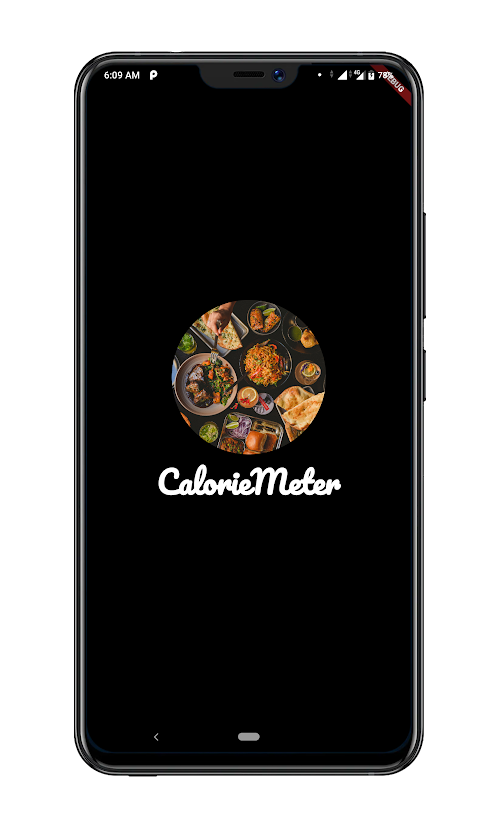
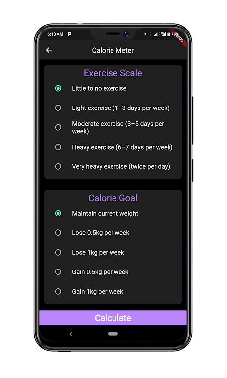

# Calorie Meter
Calorie Meter is an android app that helps user to measure their daily BMI(Body Mass Index) and BMR (Basal Metabolic Rate) and let them achieve their goal.
  
## Screenshots



## APK
```
https://github.com/Yogeshk4124/CalorieMeter/blob/main/apk/caloriemeter.apk
```
